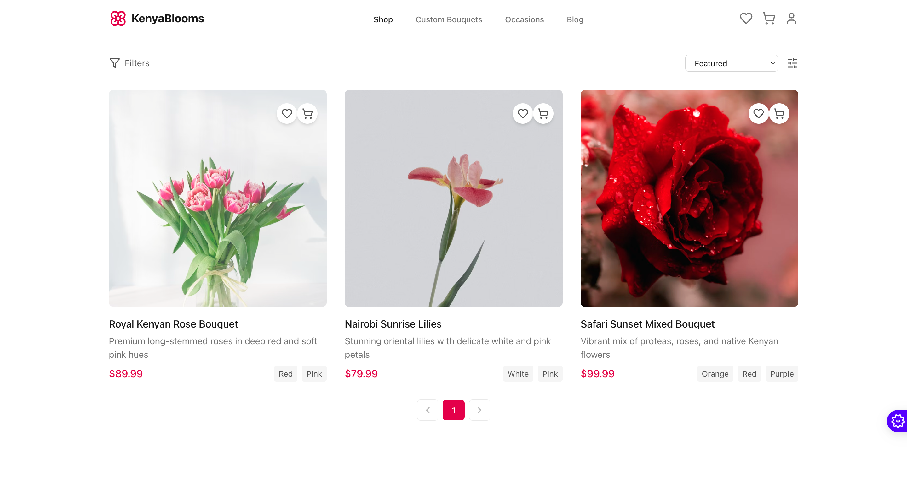
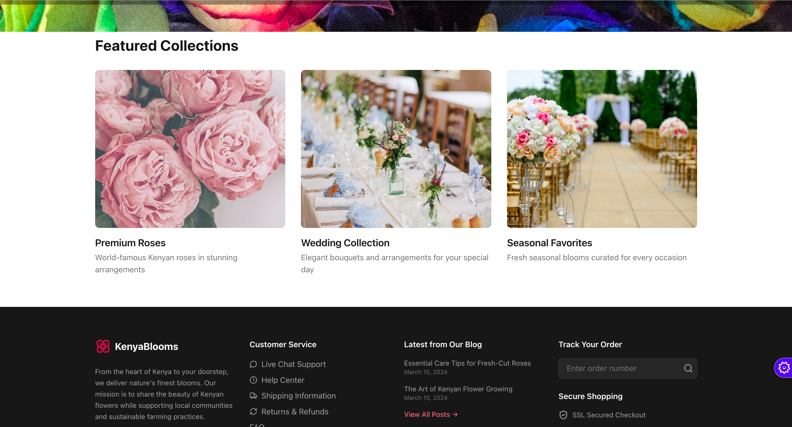
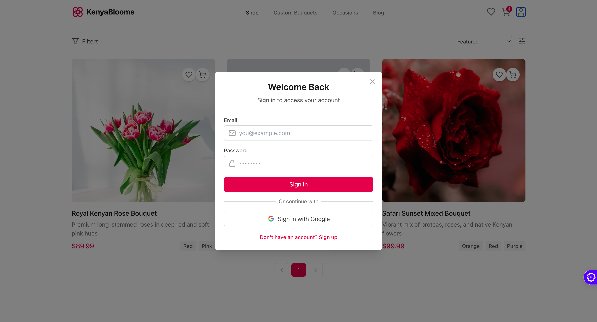
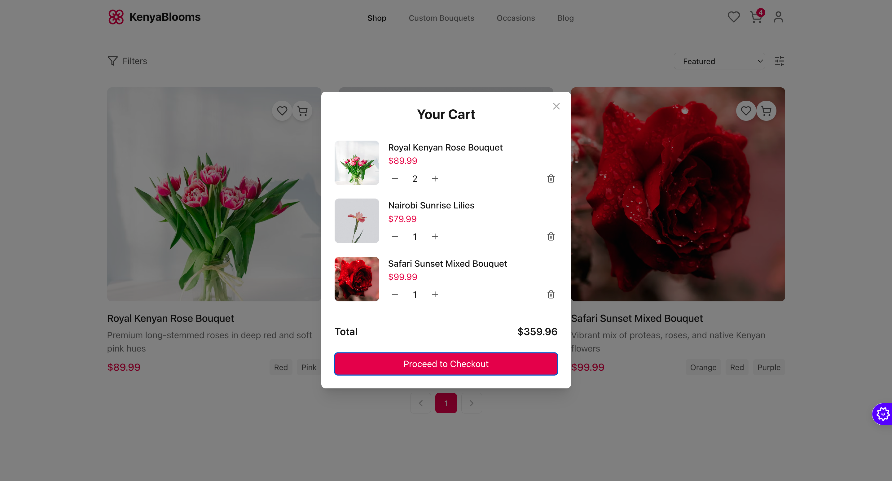

# KenyaBlooms 🌸

[]

KenyaBlooms is a premium online flower delivery platform that brings the vibrant beauty of Kenyan flowers to the world stage. Our platform connects local farmers with global flower enthusiasts, offering fresh, sustainably grown flowers delivered right to your doorstep.

## ✨ Features

- 🌹 **Premium Flower Collections**
  - World-famous Kenyan roses
  - Wedding collections
  - Seasonal favorites
  []

- 🛒 **Seamless Shopping Experience**
  - User-friendly interface
  - Secure checkout
  - Order tracking
  - Favorites list

- 📱 **Responsive Design**
  - Beautiful UI across all devices
  - Modern and clean interface
  - Optimized user experience

## 🚀 Getting Started

### Prerequisites

- Node.js (v18 or higher)
- npm or yarn

### Installation

1. Clone the repository
```bash
git clone https://github.com/your-username/Kenya-Blooms.git
cd Kenya-Blooms
```

2. Install dependencies
```bash
npm install
# or
yarn install
```

3. Start the development server
```bash
npm run dev
# or
yarn dev
```

4. Open your browser and visit `http://localhost:5173`

## 🔄 How It Works

[]

Our streamlined process ensures you get the freshest flowers with minimal environmental impact:
1. Direct sourcing from local Kenyan farmers
2. Quality inspection and sustainable packaging
3. Express delivery to your doorstep
4. Real-time order tracking

## 💐 Featured Collections

[]

Discover our most popular arrangements:
- Luxury Rose Bouquets
- Seasonal Mixed Arrangements
- Wedding & Event Collections
- Corporate Gifting Solutions

## 💝 Customer Love

[]

Join thousands of satisfied customers who have experienced the beauty of Kenyan flowers:
- "Absolutely stunning roses! The freshness and quality are unmatched." - Sarah M.
- "Perfect wedding flowers, exactly as promised. Thank you KenyaBlooms!" - James K.
- "Reliable delivery and exceptional customer service." - Lisa T.

## 🛠️ Built With

- [React](https://reactjs.org/) - Frontend framework
- [Vite](https://vitejs.dev/) - Build tool
- [TailwindCSS](https://tailwindcss.com/) - Styling
- [TypeScript](https://www.typescriptlang.org/) - Type safety
- [Zustand](https://zustand-demo.pmnd.rs/) - State management

## 📖 Project Structure

```
Kenya-Blooms/
├── src/
│   ├── components/     # UI components
│   ├── lib/           # Utilities and store
│   └── pages/         # Page components
├── public/           # Static assets
└── ... configuration files
```

## 🌿 Environmental Impact

[]

We're committed to sustainable practices:
- Eco-friendly packaging
- Support for sustainable farming
- Reduced carbon footprint initiatives

## 🤝 Contributing

We welcome contributions! Please follow these steps:

1. Fork the repository
2. Create your feature branch (`git checkout -b feature/AmazingFeature`)
3. Commit your changes (`git commit -m 'Add some AmazingFeature'`)
4. Push to the branch (`git push origin feature/AmazingFeature`)
5. Open a Pull Request

## 📝 License

This project is licensed under the MIT License - see the [LICENSE](LICENSE) file for details.

## 📞 Contact

- Website: [kenyablooms.com](https://kenyablooms.com)
- Email: hello@kenyablooms.com
- Twitter: [@kenyablooms](https://twitter.com/kenyablooms)

---

<p align="center">Made with ❤️ in Kenya</p>